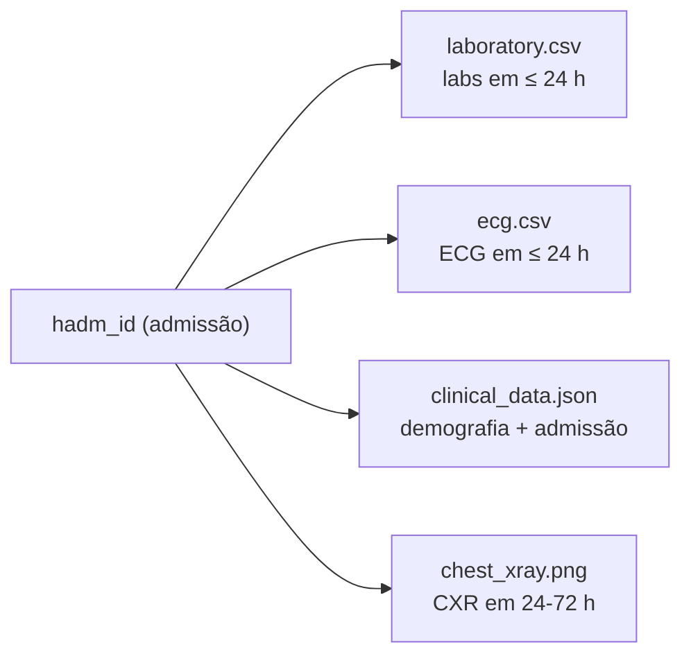

# 01 — Estudo do Dataset Symile-MIMIC

> **Objetivo do item:** apresentar uma visão geral do dataset Symile-MIMIC.
> **Fonte:** <https://physionet.org/content/symile-mimic/1.0.0/>

---

## 1. Objetivo do dataset

O Symile-MIMIC foi construído especificamente para pesquisa em **IA multimodal
aplicada à saúde**: ao contrário de datasets que trazem uma única modalidade
(só imagem, só sinal, só tabela), ele reúne **quatro modalidades clínicas de
um mesmo paciente já sincronizadas pela mesma internação** — radiografia de
tórax, ECG, exames laboratoriais e dados demográficos/administrativos. É
exatamente essa sincronização por admissão que torna o dataset adequado ao
ClinicalFusion: o projeto não precisa resolver o problema de "casar" exames
de fontes diferentes — o dataset já entrega essa associação pronta através do
`hadm_id` (ver §7).

## 2. Origem dos dados

O Symile-MIMIC deriva de três bases do ecossistema MIMIC, mantidas pelo
MIT Lab for Computational Physiology e distribuídas via PhysioNet:

| Sub-base | Modalidade | Uso no Symile-MIMIC |
|---|---|---|
| **MIMIC-CXR** | Radiografias de tórax (Chest X-Ray) | Imagens referenciadas por `cxr_path` |
| **MIMIC-IV-ECG** | Sinais de eletrocardiograma | Sinais referenciados por `ecg_path` |
| **MIMIC-IV** | Exames laboratoriais, demografia e dados administrativos da internação | `symile_mimic_data.csv`, `train/val/test.csv` |

Os dados são **desidentificados** (datas deslocadas para o futuro, sem
identificação direta de paciente) e de **acesso credenciado**: exigem conta
PhysioNet aprovada, treinamento CITI ("Data or Specimens Only Research") e
assinatura da *Data Use Agreement* (DUA), que **proíbe redistribuição** — por
isso nenhum dado real é versionado neste repositório (ver
[`../data/README.md`](../data/README.md)).

## 3. Modalidades disponíveis

- **Radiografia de tórax (Chest X-Ray)** — imagem em vista PA/AP, com achados
  radiológicos rotulados pelo classificador **CheXpert** (14 categorias:
  `positivo`/`negativo`/`incerto`/ausente).
- **Eletrocardiograma (ECG)** — sinal de 12 derivações, amostrado a alta
  frequência, registrado próximo à admissão.
- **Exames laboratoriais** — painel de 50 exames (hematologia, bioquímica,
  coagulação), com valor medido e percentil em relação à distribuição de
  treino.
- **Dados demográficos e informações clínicas** — idade, sexo, raça/etnia e
  dados administrativos da internação (tipo de admissão, origem, desfecho,
  datas de entrada/alta).

## 4. Número aproximado de casos utilizados no projeto

O projeto usa **150 casos** (dentro da faixa de 100–500 pedida pelo
enunciado), gerados por `python -m src.build_subset --n-casos 150`.

**Critério de seleção:** os casos vêm dos **positivos do `test.csv`** — as
primeiras 464 linhas do arquivo, uma por admissão, todas de pacientes
distintos. Esse split foi escolhido por um motivo prático: a ordem das linhas
dos positivos acompanha a ordem das imagens em `cxr_test.npy`, o único tensor
de radiografia que veio no material disponibilizado. Como consequência, os
**primeiros casos do subconjunto são exatamente aqueles com radiografia
real** (`patient_0001`–`patient_0046`, ver §5).

## 5. Estrutura geral da base

O material bruto do Symile-MIMIC recebido pela equipe traz:

| Arquivo | Situação |
|---|---|
| `symile_mimic_data.csv` (demografia + 14 achados CheXpert) | ✅ completo — 11.622 admissões |
| `train.csv` / `val.csv` / `test.csv` (exames laboratoriais) | ✅ completos |
| `labs_means.json` (médias de percentil dos 50 exames) | ✅ completo |
| `code/` (scripts originais de geração do dataset) | ✅ completo |
| `symile_mimic_model.ckpt` (checkpoint do modelo treinado, 738 MB) | ✅ íntegro |
| `data_npy/test/cxr_test.npy` | ⚠️ **truncado** — cabeçalho declara 4.640 imagens (~5,7 GB), mas o arquivo tem 57 MB: só **46 imagens** íntegras |
| `data_npy/*/ecg_*.npy` | ❌ **ausentes** — nenhum sinal de ECG foi disponibilizado |
| `data_npy/train|val/cxr_*.npy` | ❌ **ausentes** |

As colunas `cxr_path` e `ecg_path` dos CSVs apontam para o **MIMIC-CXR-JPG**
e o **MIMIC-IV-ECG** completos — datasets à parte, não disponibilizados.

**Consequência para o projeto:** exames laboratoriais e dados clínicos são
**reais** para todos os 150 casos; a radiografia é **real** apenas nos 46
primeiros casos (placeholder legível nos demais); o **ECG é sempre
sintético** (mock), respeitando o formato real (12 derivações, 5000 amostras,
`[-1, 1]`) para que o código de leitura seja idêntico ao de um dado
verdadeiro. Detalhes em [`../data/README.md`](../data/README.md).

## 6. Organização dos arquivos

O subconjunto do projeto segue o formato **uma-pasta-por-paciente** pedido no
enunciado (`data/symile-mimic/patient_XXXX/{chest_xray.png, ecg.csv,
laboratory.csv, clinical_data.json}` + `index.csv`). O schema completo de cada
arquivo está detalhado em [`02-organizacao-modalidades.md`](02-organizacao-modalidades.md)
e em [`../data/README.md`](../data/README.md).

## 7. Relação entre as modalidades de um mesmo paciente

A chave real do dataset é a **admissão hospitalar (`hadm_id`)**, não o
paciente: um mesmo `subject_id` pode ter várias admissões, e o Symile-MIMIC
sincroniza as modalidades **dentro de uma admissão**, dentro de uma janela de
tempo relativa à entrada:

- **exames laboratoriais** — colhidos até 24h após a admissão;
- **ECG** — registrado até 24h após a admissão;
- **radiografia** — feita entre 24h e 72h após a admissão;
- **dados clínicos** — da própria admissão.

No subconjunto do projeto, `patient_XXXX` é um apelido sequencial de um
`hadm_id`, preservado em `clinical_data.json` e no `index.csv`.

---

## 📊 Diagrama / esquema

> ⚠️ Lembrete: os dados reais **não vão para o GitHub** (DUA). Ver
> [`../data/README.md`](../data/README.md).
