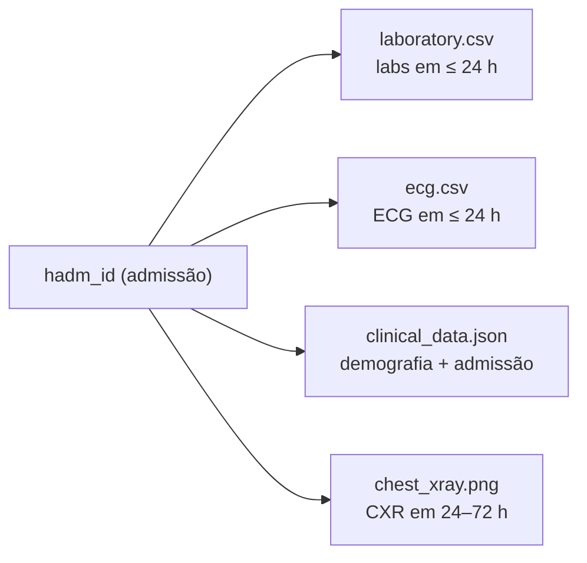

# 02 — Organização das Modalidades de Dados

> **Objetivo do item:** apresentar como os dados do subconjunto escolhido foram organizados e como cada modalidade é associada ao mesmo paciente.

---

## 1. Quantidade de casos selecionados

**150 casos** (o enunciado pede entre $100$ e $500$), gerados por `python -m src.build_subset --n-casos 150`.

**Critério de seleção.** Os casos saem dos **positivos do `test.csv`** — as primeiras $464$ linhas do arquivo, uma por admissão, todas de pacientes distintos. Escolhemos esse split por um motivo prático: a ordem das linhas dos positivos acompanha a ordem das imagens no `cxr_test.npy`, o único tensor de radiografia que recebemos. Assim, os primeiros casos do subconjunto são exatamente aqueles para os quais **existe radiografia real**.

## 2. Estrutura de pastas

Uma pasta por paciente, como pede o enunciado:

```
data/symile-mimic/               # (local, ignorado pelo Git — DUA)
├── index.csv
├── patient_0001/
│   ├── chest_xray.png
│   ├── ecg.csv
│   ├── laboratory.csv
│   └── clinical_data.json
├── patient_0002/
└── ...                          # até patient_0150
```

## 3. Localização de cada modalidade

| Modalidade | Arquivo | Observações |
|------------|---------|-------------|
| Radiografia de tórax | `patient_XXXX/chest_xray.png` | RGB $320 \times 320$. **Real** em `patient_0001`–`patient_0046`; placeholder marcado nos demais |
| ECG | `patient_XXXX/ecg.csv` | $5000$ amostras @ $500\,\mathrm{Hz}$ ($10\,\mathrm{s}$), 12 derivações. **Mock** em todos os casos |
| Exames laboratoriais | `patient_XXXX/laboratory.csv` | 50 exames, **reais**, incluindo os ausentes |
| Dados clínicos | `patient_XXXX/clinical_data.json` | Demografia, admissão e achados do CheXpert. **Reais** |

A origem de cada modalidade está detalhada em [`../data/README.md`](../data/README.md).

## 4. Schema de cada arquivo

**`laboratory.csv`** — sempre as mesmas 50 linhas, na mesma ordem:

| Coluna | Tipo | Descrição |
|--------|------|-----------|
| `itemid` | str | Código do exame no MIMIC-IV (ex.: `51221`) |
| `exame` | str | Nome legível (ex.: `Hematocrit`) |
| `valor` | float | Valor medido; vazio se ausente |
| `percentil` | float | Valor em percentil da distribuição de treino ($0$–$1$) |
| `ausente` | bool | `True` se o exame não foi medido nesta admissão |

Manter os exames ausentes como linha explícita reproduz o tratamento do dataset original, que usa um vetor de indicadores de ausência ao lado dos percentis. Na mediana, cada caso tem **$34$ dos $50$** exames medidos.

**`ecg.csv`** — $5000$ linhas:

| Coluna | Descrição |
|--------|-----------|
| `tempo_s` | Instante da amostra, de $0$ a $9{,}998\,\mathrm{s}$ |
| `I`, `II`, `III`, `aVR`, `aVL`, `aVF`, `V1`–`V6` | As 12 derivações, normalizadas em $[-1, 1]$ |

**`clinical_data.json`**:

```json
{
  "paciente_id": "patient_0001",
  "subject_id": 11653463,
  "hadm_id": 28401574,
  "demografia": { "idade": 61, "sexo": "F", "raca": "PORTUGUESE" },
  "admissao": {
    "tipo": "SURGICAL SAME DAY ADMISSION",
    "origem": "PHYSICIAN REFERRAL",
    "desfecho": "HOME HEALTH CARE",
    "obito_hospitalar": false,
    "admissao_em": "2116-03-06 07:15:00",
    "alta_em": "2116-03-13 13:21:00"
  },
  "radiografia": {
    "posicao": "PA",
    "achados_chexpert": { "Atelectasis": "positivo", "Pneumonia": "negativo" }
  },
  "_proveniencia": { "radiografia": "real", "ecg": "mock", "...": "..." }
}
```

> Os achados do CheXpert assumem `positivo`, `negativo` ou `incerto`. Um achado **não mencionado** no laudo é omitido do JSON — ausência de menção não é o mesmo que ausência do achado.

> ⚠️ Note que o enunciado sugeria campos como "queixa principal" e "comorbidades". Eles **não existem** no Symile-MIMIC: o dataset traz demografia, dados administrativos da admissão e os achados radiológicos rotulados. O quadro clínico precisa ser inferido a partir dessas evidências.

## 5. Associação das modalidades ao mesmo paciente

A chave real do dataset é a **admissão hospitalar (`hadm_id`)**, não o paciente: um mesmo `subject_id` pode ter várias admissões, e o Symile-MIMIC sincroniza as modalidades **dentro de uma admissão**. O `hadm_id` é o que amarra tudo:

- **exames laboratoriais** — colhidos até $24\,\mathrm{h}$ após a admissão;
- **ECG** — registrado até $24\,\mathrm{h}$ após a admissão;
- **radiografia** — feita entre $24$ e $72\,\mathrm{h}$ após a admissão;
- **dados clínicos** — da própria admissão.

No subconjunto, `patient_XXXX` é um apelido sequencial de um `hadm_id`, preservado em `clinical_data.json` e no `index.csv`. Como os positivos do `test.csv` têm um `subject_id` distinto cada, **cada `patient_XXXX` corresponde também a um paciente diferente**.



---

> ⚠️ Lembrete: os dados reais **não vão para o GitHub** (DUA). Ver [`../data/README.md`](../data/README.md).
