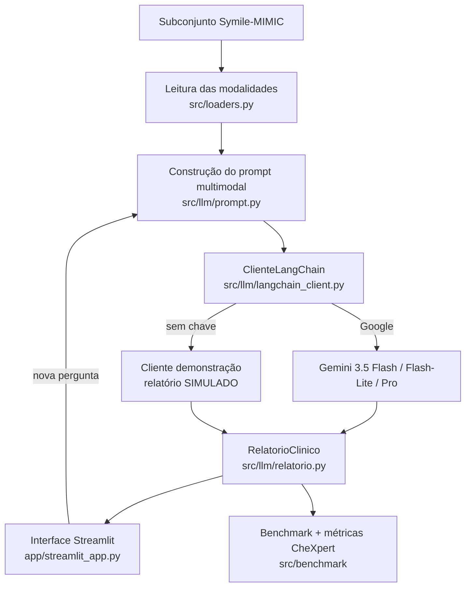

# 04 — Definição da Arquitetura da Solução

> **Objetivo do item:** apresentar uma arquitetura mais detalhada do que o pipeline do enunciado, mostrando os componentes da aplicação e como se comunicam.

---

## 1. Visão geral

O ClinicalFusion segue uma arquitetura **em camadas**, com uma **fronteira
estável** entre a aplicação e o provedor de LLM: tudo passa por
`ClienteLLM.gerar(prompt) -> RespostaLLM`, o que permite trocar de modelo (ou
reativar outros provedores) sem tocar na interface, no benchmark ou nos
testes. Não há banco de dados relacional: o subconjunto do Symile-MIMIC é
distribuído em arquivos (uma pasta por paciente), e `src/loaders.py` é a
única porta de entrada para essa estrutura — decisão coerente com o formato
"uma-pasta-por-paciente" pedido no enunciado e com o volume do projeto
(100-500 casos).

## 2. Componentes

- **Camada de dados** (`src/config.py`, `src/symile_source.py`,
  `src/build_subset.py`, `src/loaders.py`) — lê o Symile-MIMIC bruto
  (credenciado) e monta/lê o subconjunto uma-pasta-por-paciente.
- **Mock/Augmentation** (`src/mock.py`, `src/augmentation.py`) — gera o ECG
  sintético e o placeholder de radiografia; aumenta as 46 CXR reais
  preservando os achados CheXpert (`--n-variacoes`).
- **Integração multimodal / construção do prompt** (`src/llm/prompt.py`) —
  unifica as quatro modalidades (dados clínicos + exames + radiografia +
  ECG marcado como sintético) em um único prompt multimodal; a pergunta do
  usuário é **opcional** — o relatório completo sai com um clique, e o
  diálogo livre fica na aba Chat.
- **LLM multimodal** (`src/llm/langchain_client.py`, `catalogo.py`) — um
  único `ClienteLangChain` fala com o **Gemini** (`ChatGoogleGenerativeAI`)
  através do LangChain. A equipe decidiu concentrar o catálogo **apenas no
  Gemini** (ver §3) para não manter três caminhos de provedor sem cobertura
  de teste ao vivo; o código do cliente permanece *provider-agnostic* e pode
  reativar OpenAI/Anthropic re-adicionando a fábrica correspondente.
- **Relatório estruturado** (`src/llm/relatorio.py`) — esquema
  `RelatorioClinico` (achados CheXpert avaliáveis + resumo/achados/hipóteses/
  justificativa/exames/aviso do RF09), construído a partir do JSON devolvido
  pelo modelo.
- **Benchmark** (`src/benchmark/metricas.py`, `runner.py`) — compara modelos
  do catálogo na tarefa central, pontuando os achados radiológicos contra o
  ground-truth CheXpert (F1, latência, tokens, custo, completude).
- **Exportação** (`src/export_pdf.py`) — relatório em PDF (desafio extra).
- **Automação** (`src/gerar_relatorio.py`, `src/exportar_pdf.py`) — pontos de
  entrada CLI para gerar o relatório de um caso fora da interface: um devolve
  JSON no stdout, o outro já grava o PDF em disco.
- **Interface** (`app/streamlit_app.py`, `app/dados.py`) — exibição do caso
  (Dados clínicos, Radiografia, ECG, Laboratório), chat com memória,
  relatório com um clique + painel de evidências, comparação de dois casos e
  histórico da sessão.

## 3. Diagrama da arquitetura

## 4. Fluxo de comunicação entre os componentes

| De | Para | Contrato (entrada → saída) |
|---|---|---|
| `src/build_subset.py` | `data/symile-mimic/` | dataset bruto credenciado → pasta por paciente (4 arquivos + `index.csv`) |
| `src/loaders.py` | `app/`, `src/llm/`, `src/benchmark/` | `paciente_id: str` → `Caso` (radiografia `Image`, ECG/lab `DataFrame`, dados clínicos `dict`) |
| `src/llm/prompt.py` | `src/llm/langchain_client.py` | `Caso` (+ pergunta opcional) → `PromptMultimodal` (system + texto + imagem `data:` URI) |
| `src/llm/langchain_client.py` | `src/llm/relatorio.py` | `PromptMultimodal` → texto JSON do modelo |
| `src/llm/relatorio.py` | `app/streamlit_app.py`, `src/benchmark/` | texto JSON → `RelatorioClinico` (achados CheXpert + campos do RF09) |
| `app/streamlit_app.py` | `src/llm/langchain_client.py` | seleção de caso/modelo/pergunta → `RespostaLLM` (relatório + telemetria: latência, tokens, custo) |

Essa cadeia de contratos estáveis é o que permite, por exemplo, trocar o
provedor do LLM ou substituir o ECG mock por um sinal real sem alterar a
assinatura de nenhuma função a jusante.
