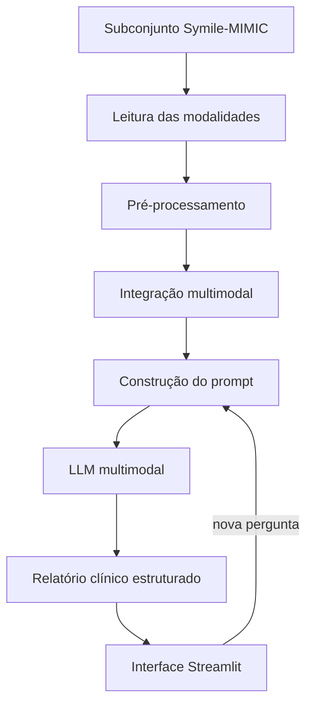

# 04 — Definição da Arquitetura da Solução

> **Objetivo do item:** apresentar uma arquitetura mais detalhada do que o pipeline do enunciado, mostrando os componentes da aplicação e como se comunicam.

---

## 1. Visão geral

> _A preencher pela equipe._ Descrição textual da arquitetura proposta.

## 2. Componentes

> _A preencher pela equipe._ Detalhar cada camada/componente e sua responsabilidade, por exemplo:
> - **Camada de dados** — leitura das 4 modalidades a partir do subconjunto do Symile-MIMIC.
> - **Camada de pré-processamento** — normalização de imagem, sinais e tabelas.
> - **Integração multimodal** — unificação das modalidades em uma representação do caso.
> - **Construção do prompt** — dados clínicos + exames + pergunta do usuário + instruções.
> - **LLM multimodal** — geração do relatório estruturado.
> - **Interface (Streamlit)** — exibição do caso, dos exames e do relatório.

## 3. Diagrama da arquitetura

> _Inserir o diagrama. Sugestão: diagrama em Mermaid (renderiza direto no GitHub)._

## 4. Fluxo de comunicação entre os componentes

> _A preencher pela equipe._ Descrever as interfaces/contratos entre os módulos (entradas e saídas de cada etapa).
