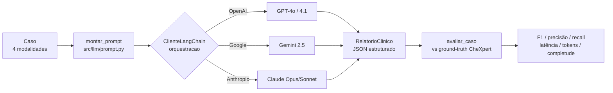

# 06 — Benchmark de LLMs Multimodais e Integração

> **Objetivo (Semana 2/3):** montar o ambiente que integra o LLM multimodal,
> constrói os prompts, gera os relatórios estruturados e **valida as respostas**,
> comparando diferentes modelos para decidir a melhor escolha para o projeto.

---

## 1. Visão geral

O ambiente vive em dois pacotes:

- **`src/llm/`** — camada de integração com os LLMs, **orquestrada por LangChain**.
  Fronteira única entre a aplicação e os provedores: OpenAI, Google (Gemini) e
  Anthropic (Claude). Um único cliente (`ClienteLangChain`) usa o chat model do
  LangChain de cada provedor (`ChatOpenAI`, `ChatGoogleGenerativeAI`,
  `ChatAnthropic`): a mensagem multimodal é montada uma vez no formato comum do
  LangChain e a mesma invocação serve para todos. Tudo por trás da interface
  `ClienteLLM.gerar`, então trocar de modelo não muda nenhuma assinatura.
- **`src/benchmark/`** — compara os modelos na tarefa central do projeto (gerar o
  relatório clínico estruturado) e pontua objetivamente os achados radiológicos.

Fluxo de uma avaliação:



---

## 2. Dataset augmentation (radiografias reais)

Do material disponibilizado só **46 radiografias** vieram íntegras (ver
[`../data/README.md`](../data/README.md)). Para termos um conjunto de avaliação
de visão maior — e ainda assim **ancorado em dado real** — `src/augmentation.py`
gera variações das CXR reais **preservando os achados CheXpert**, que são o
ground-truth do benchmark.

Só aplicamos transformações que **não invalidam o rótulo**: rotações pequenas,
variação de brilho/contraste/gama, leve zoom-crop e ruído gaussiano — tudo que
simula variação de aquisição. **Não** aplicamos espelhamento horizontal: ele
inverteria a lateralidade (coração no lado errado) e tornaria rótulos como
*Cardiomegaly* ou *Pleural Effusion* inconsistentes. Cada variação é
determinística por `(paciente, índice)`, para o conjunto ser reprodutível.

```bash
# 4 variações por radiografia real -> 46 x (1 original + 4) = 230 imagens
python -m src.augmentation --n-variacoes 4
```

Saída em `data/symile-mimic-aug/` (ignorada pelo Git, como o subconjunto base).

---

## 3. O relatório estruturado (RF08/RF09)

O LLM devolve **um único JSON** (`src/llm/relatorio.py`) com duas partes:

| Campo | Papel |
|-------|-------|
| `achados_radiologicos` | Os 14 achados do CheXpert, cada um `positivo`/`negativo`/`indeterminado`. **Parte avaliável** — comparada com o ground-truth. |
| `resumo`, `achados_principais`, `hipoteses`, `justificativa`, `exames_sugeridos`, `aviso` | O relatório educacional que o usuário lê (RF09). |

Manter as duas partes na **mesma inferência** garante que a nota objetiva e a
resposta exibida venham da mesma resposta do modelo — sem uma segunda chamada.

---

## 4. Métrica de validação (ancorada no CheXpert)

O dataset traz, por caso com radiografia real, um subconjunto dos 14 achados
rotulado como `positivo`/`negativo`. Esse é o **ground-truth**. Para cada modelo:

- **F1 / precisão / recall** da classe *positivo* (achado presente), micro-média
  sobre todos os pares `(caso, achado)` rotulados. **F1 é a métrica principal.**
- **Acurácia** dos achados avaliados.
- **Completude** do relatório textual (fração dos campos do RF09 preenchidos).
- **Latência** média e **tokens** de entrada/saída (proxy de custo).
- **Falhas** de formato (respostas que não viraram JSON válido).

---

## 5. Como rodar o benchmark

```bash
# 1. ver o catálogo e quais chaves faltam
python -m src.benchmark.runner --listar

# 2. rodar a comparação (um modelo por provedor, por padrão)
python -m src.benchmark.runner

# variações úteis
python -m src.benchmark.runner --com-aug              # inclui as variações aumentadas
python -m src.benchmark.runner --limite 20            # só 20 amostras (teste rápido/barato)
python -m src.benchmark.runner --modelos claude-opus gpt-4o gemini-flash
```

Resultados em `benchmark_resultados/` (ignorado pelo Git):
`relatorio.md` (tabela comparativa), `resumo.csv` e `respostas_<modelo>.json`.

> **Sem chaves configuradas, nada roda** — o ambiente fica pronto e o benchmark
> apenas reporta o que falta. Assim dá para preparar tudo antes de ter as chaves.

---

## 6. Modelos e chaves de API necessárias

Preencha no `.env` (ver [`../.env.example`](../.env.example)) **apenas** os
provedores que for usar; um modelo sem chave é pulado.

| Provedor | Variável de ambiente | Modelos no catálogo | Onde obter |
|----------|----------------------|---------------------|------------|
| OpenAI | `OPENAI_API_KEY` | `gpt-4o`, `gpt-4.1` | <https://platform.openai.com/api-keys> |
| Google | `GOOGLE_API_KEY` | `gemini-2.5-flash`, `gemini-2.5-pro` | <https://aistudio.google.com/apikey> |
| Anthropic | `ANTHROPIC_API_KEY` | `claude-opus-4-8`, `claude-sonnet-5` | <https://console.anthropic.com/settings/keys> |

Adicionar um modelo ao benchmark é **adicionar uma linha** em
`src/llm/catalogo.py` — nada mais muda.

---

## 7. Recomendação de modelo (a confirmar pelo benchmark)

A decisão final sai dos números, mas a hipótese de partida — para uma tarefa de
**raciocínio clínico multimodal com saída estruturada e rubrica** — é:

1. **Claude Opus 4.8** (`claude-opus-4-8`) como principal: visão forte e ótimo em
   seguir esquema estruturado e justificar conclusões — o que o RF09 exige.
2. **Gemini 2.5 Flash** como alternativa de **custo-benefício**: multimodal
   competente e barato para o volume de casos.
3. **GPT-4o** como baseline de referência amplamente validado.

Rode o benchmark com as três chaves e deixe o `relatorio.md` decidir por
**F1 × latência × custo**. Para produção com muitos casos, se um modelo mais
barato empatar em F1 com o topo de linha, ele passa a ser a escolha racional.

---

## 8. Limitações e pontos de atenção

- O ground-truth CheXpert é **parcial** por caso (só os achados mencionados no
  laudo) e cobre **46 casos reais** + suas variações. É um sinal objetivo, não
  uma validação clínica.
- A **completude** é um proxy automático da qualidade do texto, não avaliação
  humana — para a Semana 4, vale uma rubrica qualitativa revisada por pessoa.
- O **ECG** é mock e é declarado como indisponível no prompt, para o modelo não
  inventar laudo de ECG.
- Custo real de API depende de preço por token de cada provedor; o benchmark
  registra os tokens, mas não converte em moeda.
