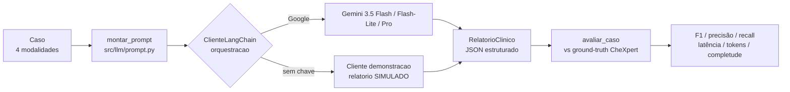

# 06 — Benchmark de LLMs Multimodais e Integração

> **Objetivo (Semana 2/3):** montar o ambiente que integra o LLM multimodal,
> constrói os prompts, gera os relatórios estruturados e **valida as respostas**,
> comparando diferentes modelos para decidir a melhor escolha para o projeto.

---

## 1. Visão geral

O ambiente vive em dois pacotes:

- **`src/llm/`** — camada de integração com os LLMs, **orquestrada por LangChain**.
  Fronteira única entre a aplicação e o provedor. O catálogo de produção é
  **somente Gemini** (decisão da equipe, ver
  [`04-arquitetura-solucao.md`](04-arquitetura-solucao.md)): um único cliente
  (`ClienteLangChain`) monta a mensagem multimodal no formato comum do LangChain
  e invoca o `ChatGoogleGenerativeAI`. O código permanece *provider-agnostic* —
  reativar OpenAI ou Anthropic é re-adicionar a fábrica correspondente e a
  dependência `langchain-openai`/`langchain-anthropic`. Tudo por trás da
  interface `ClienteLLM.gerar`, então trocar de modelo não muda nenhuma
  assinatura.
- **`src/benchmark/`** — compara os modelos na tarefa central do projeto (gerar o
  relatório clínico estruturado) e pontua objetivamente os achados radiológicos.

Fluxo de uma avaliação:



---

## 2. Dataset augmentation (radiografias reais)

Do material disponibilizado só **46 radiografias** vieram íntegras (ver
[`../data/README.md`](../data/README.md)). Para termos um conjunto de avaliação
de visão maior — e ainda assim **ancorado em dado real** — `src/augmentation.py`
gera variações das CXR reais **preservando os achados CheXpert**, que são o
ground-truth do benchmark.

Só aplicamos transformações que **não invalidam o rótulo**: rotações pequenas,
variação de brilho/contraste/gama, leve zoom-crop e ruído gaussiano — tudo que
simula variação de aquisição. **Não** aplicamos espelhamento horizontal: ele
inverteria a lateralidade (coração no lado errado) e tornaria rótulos como
*Cardiomegaly* ou *Pleural Effusion* inconsistentes. Cada variação é
determinística por `(paciente, índice)`, para o conjunto ser reprodutível.

```bash
# 4 variações por radiografia real -> 46 x (1 original + 4) = 230 imagens
python -m src.augmentation --n-variacoes 4
```

Saída em `data/symile-mimic-aug/` (ignorada pelo Git, como o subconjunto base).

---

## 3. O relatório estruturado (RF08/RF09)

O LLM devolve **um único JSON** (`src/llm/relatorio.py`) com duas partes:

| Campo | Papel |
|-------|-------|
| `achados_radiologicos` | Os 14 achados do CheXpert, cada um `positivo`/`negativo`/`indeterminado`. **Parte avaliável** — comparada com o ground-truth. |
| `resumo`, `achados_principais`, `hipoteses`, `justificativa`, `exames_sugeridos`, `aviso` | O relatório educacional que o usuário lê (RF09). |

Manter as duas partes na **mesma inferência** garante que a nota objetiva e a
resposta exibida venham da mesma resposta do modelo — sem uma segunda chamada.

---

## 4. Métrica de validação (ancorada no CheXpert)

O dataset traz, por caso com radiografia real, um subconjunto dos 14 achados
rotulado como `positivo`/`negativo`. Esse é o **ground-truth**. Para cada modelo:

- **F1 / precisão / recall** da classe *positivo* (achado presente), micro-média
  sobre todos os pares `(caso, achado)` rotulados. **F1 é a métrica principal.**
- **Acurácia** dos achados avaliados.
- **Completude** do relatório textual (fração dos campos do RF09 preenchidos).
- **Latência** média, **tokens** de entrada/saída e **custo médio estimado** em
  USD (tokens × tabela de preços de `src/llm/catalogo.py`).
- **Falhas** de formato (respostas que não viraram JSON válido).

---

## 5. Como rodar o benchmark

```bash
# 1. ver o catálogo e quais chaves faltam
python -m src.benchmark.runner --listar

# 2. rodar a comparação (CHAVES_PADRAO: gemini-flash-lite e gemini-flash)
python -m src.benchmark.runner

# variações úteis
python -m src.benchmark.runner --com-aug              # inclui as variações aumentadas
python -m src.benchmark.runner --limite 20            # só 20 amostras (teste rápido/barato)
python -m src.benchmark.runner --modelos gemini-flash-lite gemini-flash gemini-pro
```

Resultados em `benchmark_resultados/` (ignorado pelo Git):
`relatorio.md` (tabela comparativa), `resumo.csv` e `respostas_<modelo>.json`.

> **Sem chave configurada, nada roda** — o ambiente fica pronto e o benchmark
> apenas reporta o que falta. Assim dá para preparar tudo antes de ter a chave.

---

## 6. Modelos e chave de API necessária

Preencha no `.env` (ver [`../.env.example`](../.env.example)). Um modelo sem
chave é pulado.

| Provedor | Variável de ambiente | Chaves no catálogo | Modelo real | Onde obter |
|----------|----------------------|--------------------|-------------|------------|
| Google | `GOOGLE_API_KEY` | `gemini-flash-lite` | `gemini-3.5-flash-lite` | <https://aistudio.google.com/apikey> |
| Google | `GOOGLE_API_KEY` | `gemini-flash` | `gemini-3.5-flash` | idem |
| Google | `GOOGLE_API_KEY` | `gemini-pro` | `gemini-pro-latest` | idem |
| — (simulado) | `CLINICALFUSION_DEMO` | `demo` | não chama API | — |

O modelo `demo` fica **fora** de `CHAVES_PADRAO` de propósito: comparar um
molde de texto com modelos reais não produz informação útil.

Adicionar um modelo ao benchmark é **adicionar uma linha** em
`src/llm/catalogo.py` — nada mais muda. Reativar OpenAI ou Anthropic exige
também a fábrica correspondente em `src/llm/langchain_client.py` e a dependência
`langchain-openai`/`langchain-anthropic`.

---

## 7. Recomendação de modelo

O catálogo de produção é **somente Gemini**: manter três caminhos de provedor
sem cobertura de teste ao vivo custaria mais do que entrega. Dentro do Gemini, a
recomendação sai dos números do `relatorio.md`, por **F1 × latência × custo**:

1. **`gemini-flash-lite`** como padrão do projeto — mais barato e com cota
   separada, é o que a interface pré-seleciona.
2. **`gemini-flash`** quando a qualidade do texto pesar mais que o custo.
3. **`gemini-pro`** como teto de qualidade, para conferir se o flash está
   deixando algo na mesa; caro demais para o volume do benchmark.

Se um modelo mais barato empatar em F1 com o de cima, ele passa a ser a escolha
racional — é exatamente essa decisão que o benchmark automatiza.

---

## 8. Limitações e pontos de atenção

- O ground-truth CheXpert é **parcial** por caso (só os achados mencionados no
  laudo) e cobre **46 casos reais** + suas variações. É um sinal objetivo, não
  uma validação clínica.
- A **completude** é um proxy automático da qualidade do texto, não avaliação
  humana — para a Semana 4, vale uma rubrica qualitativa revisada por pessoa.
- O **ECG** é mock e é declarado como indisponível no prompt, para o modelo não
  inventar laudo de ECG.
- O **custo em USD é uma estimativa local** (tokens × preços de
  `src/llm/catalogo.py`), não uma consulta à fatura do provedor. Os preços são
  públicos, aproximados e editáveis.
