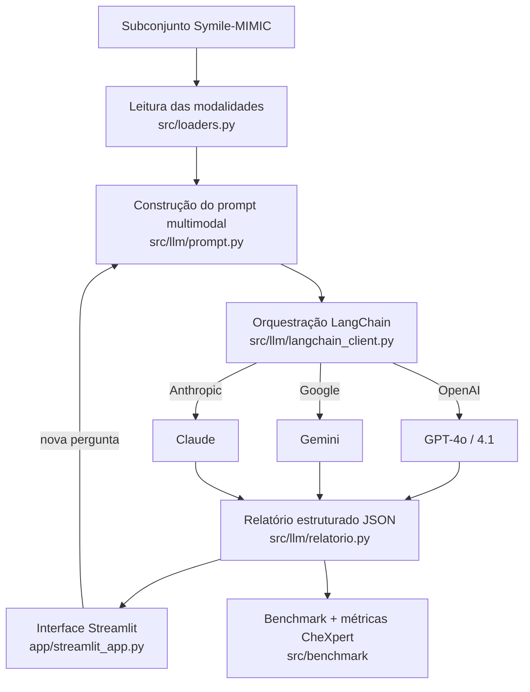

# Relatório Técnico — ClinicalFusion

**Assistente Inteligente Multimodal para Análise Integrada de Casos Clínicos utilizando LLMs Multimodais**

Disciplina de Tópicos Especiais · Projeto de 1 mês

---

## Sumário

1. Introdução e objetivo
2. Base de dados (Symile-MIMIC) e o que foi disponibilizado
3. Organização das modalidades e subconjunto
4. Dataset augmentation das radiografias reais
5. Arquitetura da solução
6. Integração com o LLM multimodal (LangChain)
7. Engenharia de prompt e relatório estruturado
8. Ambiente de benchmark e validação das respostas
9. Interface (Streamlit) e requisitos funcionais
10. Desafios extras implementados
11. Análise das tecnologias
12. Limitações e riscos
13. Como executar
14. Conclusão

---

## 1. Introdução e objetivo

O **ClinicalFusion** integra quatro modalidades de dados clínicos de um mesmo
paciente — **radiografia de tórax**, **eletrocardiograma (ECG)**, **exames
laboratoriais** e **informações clínicas/demográficas** — e gera, com um clique,
um **relatório clínico estruturado** com o apoio de um **LLM multimodal
(Vision-Language Model)**. Para aprofundar o caso em linguagem natural, a
interface traz um **chat** com memória da conversa.

O sistema tem finalidade **exclusivamente educacional**: não realiza diagnóstico
e não substitui avaliação médica. Ele produz um resumo do caso, destaca os
principais achados, apresenta hipóteses clínicas educacionais, justifica as
conclusões com base nas evidências e sugere exames complementares — sempre com um
aviso de segurança explícito.

Conceitos aplicados: LLMs multimodais, Vision-Language Models, Prompt
Engineering, orquestração com LangChain, Engenharia de Software (camadas,
testes, fronteiras estáveis) e IA Generativa aplicada à saúde.

## 2. Base de dados (Symile-MIMIC) e o que foi disponibilizado

Utilizamos o dataset público credenciado **Symile-MIMIC**
(<https://physionet.org/content/symile-mimic/1.0.0/>), construído para pesquisa em
IA multimodal em saúde, com modalidades sincronizadas por paciente.

> 🔒 O acesso é **credenciado** (conta PhysioNet + treinamento CITI + DUA). A DUA
> **proíbe redistribuição**, então nenhum dado real é versionado no repositório;
> o subconjunto é gerado localmente e bloqueado pelo `.gitignore`.

**Achado que afetou o projeto:** o material disponibilizado veio **incompleto**.

| Item | Situação |
|------|----------|
| `symile_mimic_data.csv` (demografia + 14 achados CheXpert) | ✅ completo (11.622 admissões) |
| `train/val/test.csv` (exames laboratoriais) | ✅ completos |
| `cxr_test.npy` (radiografias) | ⚠️ **truncado** — 46 imagens íntegras de 4.640 declaradas |
| `ecg_*.npy` (sinais de ECG) | ❌ **ausentes** |

**Consequência:** exames laboratoriais e dados clínicos são **reais**; a
radiografia é **real em 46 casos** e placeholder nos demais; o **ECG é sempre
sintético (mock)**. A procedência de cada modalidade é exibida na própria
interface e registrada no `clinical_data.json` de cada caso.

## 3. Organização das modalidades e subconjunto

O subconjunto segue o formato **uma-pasta-por-paciente** pedido no enunciado,
gerado por `src/build_subset.py`:

```
data/symile-mimic/
├── index.csv
├── patient_0001/
│   ├── chest_xray.png       # 320x320
│   ├── ecg.csv              # 12 derivações x 5000 amostras (mock)
│   ├── laboratory.csv       # 50 exames (com indicador de ausência)
│   └── clinical_data.json   # demografia, admissão, achados CheXpert, procedência
└── ...
```

A chave `patient_XXXX` deriva da admissão (`hadm_id`) do MIMIC-IV, que sincroniza
as quatro modalidades. Os 50 exames aparecem **sempre**, inclusive os não
medidos (`ausente = True`) — a ausência de um exame é informação clínica. Os
achados CheXpert que não constam do laudo são omitidos (não são "negativos").

A camada de leitura (`src/loaders.py`) é a **fronteira** que o resto da aplicação
enxerga: a partir dela o formato é sempre o mesmo, independentemente de a
modalidade ser real ou mock — trocar um mock por dado real depois não muda
nenhuma assinatura.

## 4. Dataset augmentation das radiografias reais

Como só temos **46 radiografias reais**, para termos um conjunto de avaliação de
visão maior — e ainda ancorado em dado real — `src/augmentation.py` gera
variações das CXR reais **preservando os achados CheXpert**, que são o
ground-truth do benchmark.

Só aplicamos transformações que **não invalidam o rótulo**: rotações pequenas
(±8°), variação de brilho/contraste/gama (±15%), leve zoom-crop e ruído
gaussiano — simulando variação de aquisição. **Não** aplicamos espelhamento
horizontal, que inverteria a lateralidade (coração no lado errado) e tornaria
rótulos como *Cardiomegaly* ou *Pleural Effusion* inconsistentes. Cada variação é
**determinística** por `(paciente, índice)`, garantindo reprodutibilidade.

Com 4 variações por caso, os 46 reais viram **230 imagens avaliáveis**
(`python -m src.augmentation --n-variacoes 4`).

## 5. Arquitetura da solução



**Camadas e responsabilidades:**

| Camada | Módulo | Responsabilidade |
|--------|--------|------------------|
| Dados | `src/config.py`, `src/symile_source.py`, `src/build_subset.py`, `src/loaders.py` | Ler o Symile-MIMIC bruto, montar e ler o subconjunto |
| Mock/Augmentation | `src/mock.py`, `src/augmentation.py` | Gerar ECG sintético e placeholder de CXR; aumentar as CXR reais |
| LLM | `src/llm/prompt.py`, `relatorio.py`, `langchain_client.py`, `catalogo.py`, `extras.py` | Prompt multimodal, esquema do relatório, orquestração dos provedores, catálogo/preços, versão para o paciente |
| Benchmark | `src/benchmark/metricas.py`, `runner.py` | Métricas ancoradas no CheXpert, execução comparativa |
| Exportação | `src/export_pdf.py` | Relatório em PDF |
| Interface | `app/streamlit_app.py`, `app/dados.py` | Exibição do caso, chat, evidências, comparação, histórico |

A separação em camadas com uma **fronteira estável** (`ClienteLLM.gerar` →
`RelatorioClinico`) permite trocar de provedor de LLM sem tocar na interface nem
no benchmark.

## 6. Integração com o LLM multimodal (LangChain)

A orquestração usa **LangChain**: um único `ClienteLangChain` instancia o chat
model de cada provedor (`ChatOpenAI`, `ChatGoogleGenerativeAI`, `ChatAnthropic`).
A mensagem multimodal (system + texto + imagem em `data:` URI) é montada **uma
vez** no formato comum do LangChain e a mesma invocação (`chat.invoke`) serve
para todos. Trocar de modelo é trocar a fábrica do chat model — nada mais.

Detalhes técnicos relevantes descobertos na integração:

- **Gemini 3.x**: o "thinking" interno consome o orçamento de tokens e trunca o
  JSON de saída; desativamos com `thinking_budget=0`. Os aliases `gemini-2.5-*`
  ficaram bloqueados para contas novas, então o catálogo usa `gemini-3.5-flash`.
  Usamos o SDK oficial atual `google-genai` (o `google-generativeai` foi
  descontinuado).
- **Robustez**: `com_retry` repete erros **transitórios** (503, rate-limit) com
  backoff, mas **falha rápido** em erros permanentes de conta (quota/billing
  esgotados) — evitando travar a interface por minutos.
- **Chaves**: lidas de `os.environ` via `config.carregar_env()`, que carrega o
  `.env` (ignorando comentários inline). Um provedor sem chave é simplesmente
  pulado.

## 7. Engenharia de prompt e relatório estruturado

O prompt (`src/llm/prompt.py`) integra as **quatro modalidades** (RF07):

1. dados clínicos e demografia;
2. exames laboratoriais **medidos** (valor + percentil);
3. a radiografia (anexada como imagem);
4. o ECG — referenciado e **marcado como sintético**, para o modelo não produzir
   laudo eletrocardiográfico com base em sinal mock.

O `system` instrui o modelo a: agir como assistente **educacional**, basear-se
nas evidências, responder **sempre** em um único objeto JSON, avaliar os **14
achados do CheXpert** (`positivo`/`negativo`/`indeterminado`) e escrever todo o
texto **em português**, traduzindo os termos que vêm em inglês no dataset —
exceto as **chaves** dos achados CheXpert, que permanecem em inglês por serem
identificadores de pontuação.

O relatório estruturado (`RelatorioClinico`) tem duas partes:

- `achados_radiologicos` — parte **avaliável**, comparada com o ground-truth;
- o relatório do RF09 — `resumo`, `achados_principais`, `hipoteses`,
  `justificativa`, `exames_sugeridos`, `aviso`.

Manter as duas partes na **mesma inferência** garante que a nota objetiva e a
resposta exibida venham da mesma resposta do modelo, sem uma segunda chamada. O
parser tolera cercas de código e normaliza valores inválidos.

## 8. Ambiente de benchmark e validação das respostas

A validação das respostas (RF/Semana 3) é feita por um **ambiente de benchmark**
(`src/benchmark`) que compara os modelos na tarefa central e pontua
**objetivamente** os achados radiológicos contra o ground-truth CheXpert do
dataset.

**Métricas** (micro-média sobre os pares `(caso, achado)` rotulados):

- **F1 / precisão / recall** da classe *positivo* (achado presente) — métrica
  principal;
- **acurácia** dos achados avaliados;
- **completude** do relatório textual (fração dos campos do RF09 preenchidos);
- **latência** média, **tokens** de entrada/saída e **custo estimado** (USD, a
  partir dos preços por modelo no catálogo);
- **falhas** de formato.

O conjunto avaliável são os **casos com radiografia real** (e, opcionalmente,
suas variações aumentadas) — o ground-truth de visão só faz sentido sobre imagem
verdadeira.

**Execução:** `python -m src.benchmark.runner [--com-aug] [--modelos ...]`. A
saída (`benchmark_resultados/`) traz `relatorio.md` (ranking), `resumo.csv` e as
respostas brutas por modelo. Sem chave configurada, nenhum modelo roda e o
ambiente reporta o que falta.

**Resultado validado (amostra):** uma inferência real do `gemini-3.5-flash` no
`patient_0001` produziu relatório coerente e **inteiramente em português**
(resumo, hipóteses e exames traduzidos), em ~14 s, ~2.295/767 tokens, custo
estimado ~US$ 0,0026. A tabela comparativa completa depende de ≥2 provedores com
quota/crédito ativos (ver §12).

## 9. Interface (Streamlit) e requisitos funcionais

A interface exibe o caso em abas (Dados clínicos, Radiografia, ECG, Laboratório)
e concentra o LLM em duas abas:

- **Chat** — é onde o médico **conversa** com o modelo sobre o caso, com memória
  da conversa (`src/llm/chat.py`). A pergunta específica ("nos exames de sangue,
  o que está elevado?") recebe uma resposta **direta**, sem repetir o relatório
  inteiro, ancorada nas evidências.
- **Relatório** — seleção do modelo e **um botão**: não há caixa de pergunta. A
  análise completa é guiada pelo *system prompt* (`src/llm/prompt.py`), que
  define o que cobrir em cada campo do relatório **estruturado** (RF08/RF09). Ao
  lado fica o **painel de evidências** (RF10) com a radiografia, o ECG, os
  exames em percentil extremo e os dados clínicos usados.

> **Por que separar assim:** exigir uma pergunta para gerar o relatório
> misturava dois usos. Quem abre um caso quer primeiro a leitura completa dele;
> quem quer perguntar já tem o chat, que responde melhor porque não precisa
> devolver o JSON inteiro a cada mensagem.

Cobertura dos requisitos:

| RF | Descrição | Onde |
|----|-----------|------|
| RF01 | Carregar caso | seletor + `loaders.carregar_caso` |
| RF02 | Dados demográficos/clínicos | aba Dados clínicos |
| RF03 | Radiografia | aba Radiografia |
| RF04 | Exames laboratoriais | aba Laboratório |
| RF05 | ECG | aba ECG |
| RF06 | Perguntas em linguagem natural | **aba Chat** conversacional com memória (e a pergunta comum aos dois casos, na aba Comparar) |
| RF07 | Integrar todas as modalidades no prompt | `prompt.montar_prompt` (ECG marcado como mock) |
| RF08 | Relatório com LLM multimodal | `ClienteLangChain.gerar` |
| RF09 | Resumo, achados, hipóteses, justificativa, exames, aviso | `renderizar_relatorio` |
| RF10 | Ver simultaneamente os exames usados | coluna de evidências |

## 10. Desafios extras implementados

| Extra (enunciado) | Status | Como |
|-------------------|--------|------|
| Comparação entre diferentes LLMs | ✅ | `src/benchmark` (F1, custo, latência) |
| Painel de métricas (tempo/custo) | ✅ | latência + tokens + **custo estimado** por geração e no benchmark |
| Tradução para linguagem do paciente | ✅ | botão "Explicar para o paciente" (`src/llm/extras.py`) |
| Geração do relatório em PDF | ✅ | `src/export_pdf.py` + botão de download |
| Comparação entre dois casos clínicos | ✅ | aba "Comparar 2 casos" |
| Histórico de casos analisados | ✅ | histórico da sessão na barra lateral |
| Explicação visual dos achados | ➖ | depende de bounding boxes do modelo — não implementado |
| Integração com n8n | ➖ | requer instância n8n externa — documentado como guia, não executado |

## 11. Análise das tecnologias

| Camada | Enunciado | Escolha | Justificativa |
|--------|-----------|---------|---------------|
| Linguagem | Python | Python | Ecossistema de dados e SDKs dos provedores |
| Interface | Streamlit | Streamlit | Prototipagem rápida de app de dados |
| Dados | Pandas | Pandas | Tabelas de laboratório e índice |
| Imagem | Pillow/OpenCV | **Pillow** | Suficiente para carregar/augmentar CXR sem o peso do OpenCV |
| Visualização | Matplotlib | Matplotlib | Traçado do ECG sobre papel milimetrado |
| LLM | GPT-4o / Gemini / Qwen / Llama | **GPT-4o, Gemini, Claude** | Provedores com API multimodal estável; Claude adicionado por força em saída estruturada |
| Framework | LangChain (opcional) | **LangChain** | Orquestração uniforme entre os três provedores |
| Versionamento | GitHub | GitHub + git-flow | `main ← develop ← feature/*` |

**Recomendação de modelo:** para raciocínio clínico multimodal com saída
estruturada, a hipótese de partida é **Claude Opus 4.8** (principal), **Gemini
Flash** (custo-benefício) e **GPT-4o** (baseline). A decisão final sai do
benchmark, por **F1 × latência × custo**.

## 12. Limitações e riscos

- **Ground-truth parcial:** o CheXpert só rotula os achados mencionados no laudo,
  e apenas 46 casos têm imagem real (+ augmentations). É um sinal objetivo, não
  validação clínica.
- **ECG mock:** referenciado no prompt, mas marcado como sintético — o modelo é
  instruído a não laudá-lo.
- **Custo/quota de API:** contas free-tier esgotam quota (429) e ficam
  indisponíveis (503); a comparação entre modelos exige ≥2 provedores com
  crédito. Os preços do catálogo são **aproximados** e editáveis.
- **Completude é um proxy automático** da qualidade textual, não avaliação
  humana — uma rubrica revisada por pessoa é recomendada para a Semana 4.

## 13. Como executar

```bash
python -m venv .venv && source .venv/bin/activate   # Windows: .venv\Scripts\Activate.ps1
pip install -r requirements.txt
cp .env.example .env        # ajuste SYMILE_MIMIC_DIR e as chaves de API
python -m src.build_subset --n-casos 150
python -m src.augmentation --n-variacoes 4          # opcional (benchmark de visão)
python -m streamlit run app/streamlit_app.py
# Benchmark:
python -m src.benchmark.runner --listar
python -m src.benchmark.runner --com-aug
# Testes:
python -m pytest tests
```

Detalhes de setup por sistema operacional em [`../SETUP.md`](../SETUP.md).

## 14. Conclusão

O ClinicalFusion cumpre os **10 requisitos funcionais** obrigatórios e vai além:
implementa a **orquestração com LangChain**, um **ambiente de benchmark ancorado
no CheXpert** (que já entrega o desafio extra de comparação entre LLMs) e vários
extras (custo, PDF, versão para o paciente, comparação de casos, histórico). A
arquitetura em camadas, com uma fronteira estável entre a aplicação e os
provedores, torna o sistema fácil de estender — trocar de modelo, adicionar um
provedor ou substituir um dado mock por real não muda as assinaturas do código.
A cobertura de **80 testes automatizados** sustenta a evolução com segurança.
